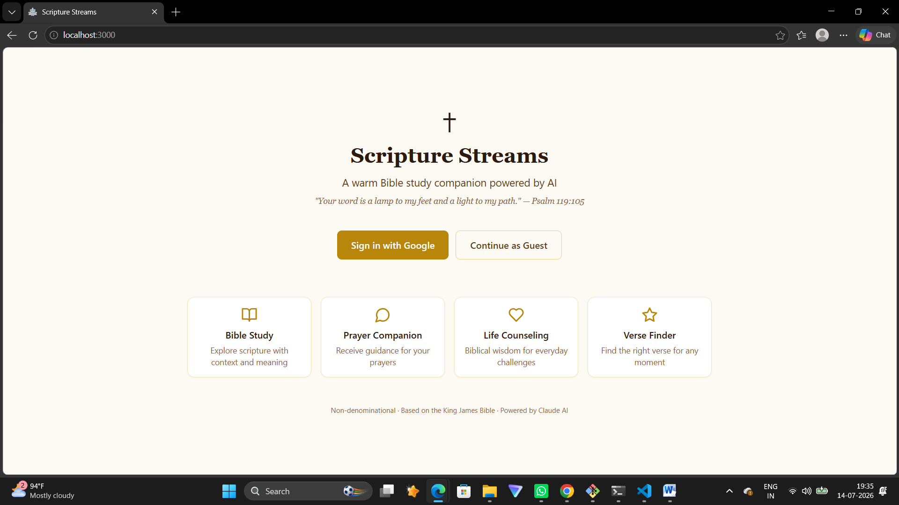

# ✝ Scripture Streams

> A warm, AI-powered Bible study companion — ask questions, get scripture-grounded answers, and have a full voice conversation with your Bible guide.

---

## Demo

### Landing Page


### Chat — Text Mode


### Chat — Voice Conversation Mode


---

## Features

- **RAG-powered answers** — retrieves the most relevant Bible passages before answering, so every response is grounded in scripture
- **Voice input** — speak your question using your microphone
- **Voice reply** — the AI reads every answer aloud
- **Conversation mode** — hands-free back-and-forth voice loop (like Alexa, but for Bible study)
- **Scripture sources** — see exactly which Bible passages were used to form the answer
- **Save verses** — bookmark any scripture reference with one click
- **Prayer notes** — keep a personal prayer journal
- **Conversation history** — all chats saved and accessible from the sidebar
- **Google sign-in** — or use as a guest with no account needed
- **Non-denominational** — welcoming to Catholics, Protestants, Baptists, and all

---

## How It Works

```
You speak / type a question
        ↓
RAG retrieves top 3 relevant Bible passages (ChromaDB)
        ↓
Passages injected into system prompt
        ↓
Ollama (llama3) generates a response, streamed word by word
        ↓
Response displayed as text + read aloud
        ↓
In conversation mode → mic auto-starts for your next question
```

---

## Tech Stack

| Layer | Technology |
|-------|-----------|
| AI Model | Ollama (llama3) — runs locally |
| Vector Database | ChromaDB |
| Embeddings | all-MiniLM-L6-v2 (SentenceTransformers) |
| Backend | FastAPI (Python) |
| Frontend | Next.js 14 + React + TypeScript |
| Database & Auth | Supabase (PostgreSQL + Google OAuth) |
| Voice Input | Web Speech API (browser built-in) |
| Voice Output | SpeechSynthesis API (browser built-in) |
| Styling | Tailwind CSS |

---

## Getting Started

### Prerequisites

- Python 3.10+
- Node.js 18+
- [Ollama](https://ollama.com) installed and running
- Supabase project (free tier works)

### 1. Clone the repo

```bash
git clone <your-repo-url>
cd scripture-streams
```

### 2. Set up environment variables

```bash
cp .env.example backend/.env.local
```

Fill in your values:

```env
SUPABASE_URL=https://xxxxxxxxxxxx.supabase.co
SUPABASE_ANON_KEY=eyJ...
```

Also create `frontend/.env.local`:

```env
NEXT_PUBLIC_SUPABASE_URL=https://xxxxxxxxxxxx.supabase.co
NEXT_PUBLIC_SUPABASE_ANON_KEY=eyJ...
```

### 3. Set up the database

Run `backend/schema.sql` in your Supabase SQL editor to create the tables.

### 4. Download the Bible JSON

Download the KJV Bible JSON from [scrollmapper/bible_databases](https://github.com/scrollmapper/bible_databases) and place it at:

```
data/bible_kjv.json
```

### 5. Build the Bible index (run once)

```bash
cd backend
python -m venv venv
.\venv\Scripts\Activate.ps1        # Windows
# source venv/bin/activate         # Mac/Linux
pip install -r requirements.txt
python ingest.py
```

### 6. Pull the AI model

```bash
ollama pull llama3
```

### 7. Start the backend

```bash
cd backend
.\venv\Scripts\Activate.ps1
uvicorn agent:app --reload --port 8000
```

### 8. Start the frontend

```bash
cd frontend
npm install
npm run dev
```

### 9. Open in browser

```
http://localhost:3000
```

> Use **Chrome or Edge** — required for voice features (SpeechRecognition API)

---

## Project Structure

```
scripture-streams/
├── backend/
│   ├── agent.py        # FastAPI server — main API endpoints
│   ├── rag.py          # Bible retrieval using ChromaDB
│   ├── ingest.py       # One-time script to build Bible vector index
│   ├── persona.py      # AI system prompt and character
│   ├── schema.sql      # Supabase database schema
│   └── requirements.txt
├── frontend/
│   ├── app/
│   │   ├── page.tsx            # Landing page
│   │   ├── chat/page.tsx       # Chat interface
│   │   ├── saved/              # Saved verses page
│   │   ├── prayer/             # Prayer notes page
│   │   └── api/chat/route.ts   # Next.js proxy to FastAPI
│   ├── components/
│   │   ├── ChatWindow.tsx      # Main chat UI + voice logic
│   │   ├── MessageBubble.tsx   # Chat message display
│   │   └── Sidebar.tsx         # Navigation + conversation history
│   └── lib/
│       ├── api.ts              # SSE stream reader
│       └── supabase.ts         # Supabase client
└── data/
    └── bible_index/            # ChromaDB vector index (generated by ingest.py)
```

---

## Voice Conversation Mode

Click the **💬 button** in the chat bar to enter hands-free conversation mode:

```
Click 💬
    ↓
Mic starts — speak your question
    ↓
AI responds (text streams + spoken aloud)
    ↓
Mic auto-starts again
    ↓
Speak your next question
    ↓
Click 💬 again to stop
```

---

## Bible Coverage

- Full KJV Bible (Old + New Testament, 66 books, 31,000+ verses)
- Passages chunked into 10-verse overlapping windows for context-aware retrieval
- Top 3 most relevant passages retrieved per question

---

## License

Private repository — all rights reserved.
